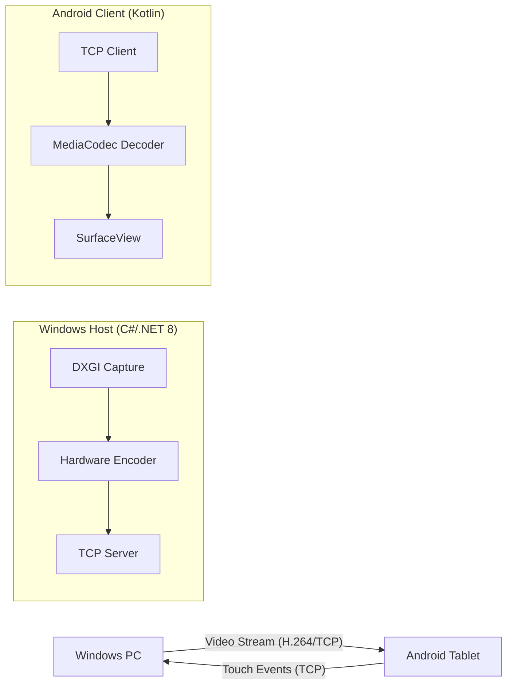

<p align="center">
  
</p>

# 📱 Tab Mirror Screen
**Transform your Samsung Galaxy Tab A9+ (or any Android tablet) into a high-performance second monitor for your Windows PC.**

[](https://opensource.org/licenses/MIT)
[](https://github.com/mashroor1in/Tab-Mirror-Screen/stargazers)
[](https://www.microsoft.com/windows)
[](https://www.android.com)

[**📥 Download Latest Release**](https://github.com/mashroor1in/Tab-Mirror-Screen/releases/latest)

A professional-grade, self-hosted, open-source solution. No subscriptions, no cloud lag, no third-party servers. Just pure performance.

---

## ✨ Key Features

- **🚀 Ultra-Low Latency**: High-speed H.264 encoding via GPU (NVENC/QSV/AMF).
- **📟 True Second Screen**: Not just mirroring, but an actual extended display workspace.
- **👆 Seamless Touch Controls**: Full touch interaction—tap, drag, right-click (long press), and scroll gestures.
- **🔌 Multi-Mode Connection**: Use USB (ADB) for the absolute lowest latency or Wi-Fi for wireless freedom.
- **🛠️ Hardware Accelerated**: Leveraging MediaCodec on Android and DXGI on Windows for efficiency.

---

## 🏗️ Architecture

Tab Mirror uses a modern client-server architecture designed for heavy workloads:



---

## 🚀 Quick Start Guide

### 1. Prerequisites
| Tool | Purpose | Download |
|------|---------|----------|
| **.NET 8 SDK** | Run the Windows Host | [Download](https://dotnet.microsoft.com/en-us/download/dotnet/8.0) |
| **FFmpeg 6.x** | Video Encoding | [Download](https://ffmpeg.org/download.html) |
| **Parsec VDD** | Virtual Monitor Driver | [Download](https://github.com/ninthsword/parsec-vdd) |
| **ADB** | USB Connectivity | `winget install Google.PlatformTools` |

### 2. Setup Virtual Display
Before streaming, you need a virtual display for Windows to "extend" into:
1. Install **Parsec Virtual Display Driver**.
2. Enable the virtual display in Windows Display Settings.
3. You should now see a second (virtual) monitor in your display layout.

### 3. Run Windows Host
```powershell
cd WindowsHost
dotnet run
# Select the virtual monitor index when prompted.
```

### 4. Connect Android Client
**USB Mode (Recommended)**
1. Enable **USB Debugging** on the tablet.
2. Run these commands to bridge the connection:
   ```powershell
   adb reverse tcp:7531 tcp:7531 # Video
   adb reverse tcp:7532 tcp:7532 # Input
   ```
3. Launch the Android app, select **USB Mode**, and tap **Connect**.

**Wi-Fi Mode**
1. Ensure both devices are on the same network.
2. Use **Auto-Discover** or enter the PC's IP address.

---

## ⌨️ Gestures

| Gesture | Action |
|---------|--------|
| **Single Tap** | Left Click |
| **Long Press** | Right Click |
| **Drag** | Mouse Movement |
| **Two-Finger Swipe** | Scroll Up/Down |

---

## 📂 Project Structure

- `WindowsHost/`: C# .NET 8 source code for screen capture, encoding (FFmpeg), and network server.
- `AndroidClient/`: Kotlin source code for the Android application, hardware decoding, and touch relay.
- `VirtualMonitor/`: Drivers and utilities for the virtual display setup.

---

## 🛠️ Performance Tuning

For the best experience, adjust these values in `WindowsHost/Program.cs`:
- **Bitrate**: `6000-10000` for Wi-Fi, `12000+` for USB.
- **Target FPS**: `60` for smooth motion.
- **Resolution**: Match your tablet's native resolution (e.g., `2560x1600`).

---

## 🤝 Contributing

Contributions are welcome! Please feel free to submit a Pull Request.

---

## 📄 License

This project is licensed under the MIT License - see the [LICENSE](LICENSE) file for details.

---
<p align="center">Made with ❤️ for the Samsung Community</p>
